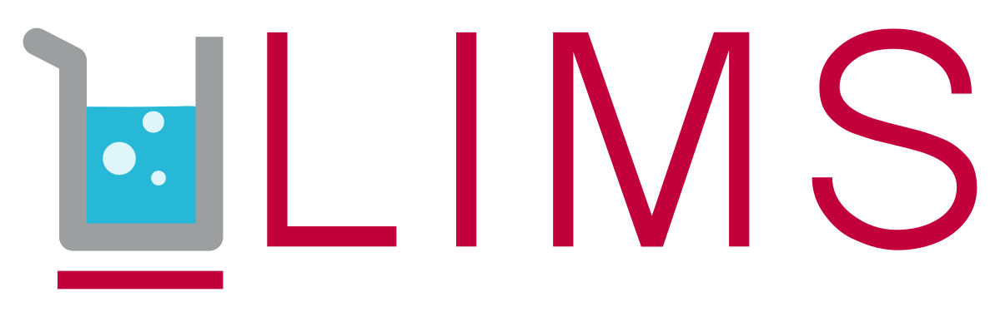

# ULims un gestionnaire de réserve de produits chimique

## Fonctionnalités

L'application web a les fonctionnalité suivantes:
- Gestion des utilisateurs avec 3 roles:
  1. User: Utilisateurs pouvant consulter toutes les informations sur les produits et l'historique. Peut également agir sur le stock.
  2. Admin: Utilisateur pouvant modifier/ajouter/supprimer des utilisateurs.
  3. Superuser: Utilisaeur unique ne pouvant pas être modifié. Il peut modifer/ajouter/supprimer des admins.

Les rôles héritent des propriétés des rôles précédents. Par exemple Admin hérite des propriétés de User. Un utilisateur non authentifié peut consulter les  informations sur les produits/historique sans les modifier.

- Gestion du stock du produits
  - Les actions suivantes sont possibles sur les produits:
    1. Ajout/Supression/Modification
    2. Prendre/Range/Déplacer
    L'ajout de produit est autocomplétée par les informations de [PuChem](https://pubchem.ncbi.nlm.nih.gov/).
  - Le système tient compte des incompatibilités de stockage de produits: selon une liste fournie, le système vous prévient si vous voulez stocker deux produits incompatibles au même emplacement.
  - Les informations sur les produits fournies par [PuChem](https://pubchem.ncbi.nlm.nih.gov/) sont facilement accessibles.
   
## Documentation
  - Wiki du projet: https://github.com/ArnaudPalgen/ma2_web_technologies/wiki
  - Code source: https://github.com/ArnaudPalgen/ma2_web_technologies

## Contact
Le projet a été réalisé par [Serge Nshimiyimana](mailto:serge.nshimiyimana@student.umons.ac.be), [Arnaud Palgen](mailto:arnaud.palgen@student.umons.ac.be) et [Pierre Zielenski](mailto:pierre.zielenski@student.umons.ac.be) @student.umons.ac.be pour le cours de Web Technology de l'Université de Mons.
Pour plus d'informations n'hésitez pas à nous contacter par email !
